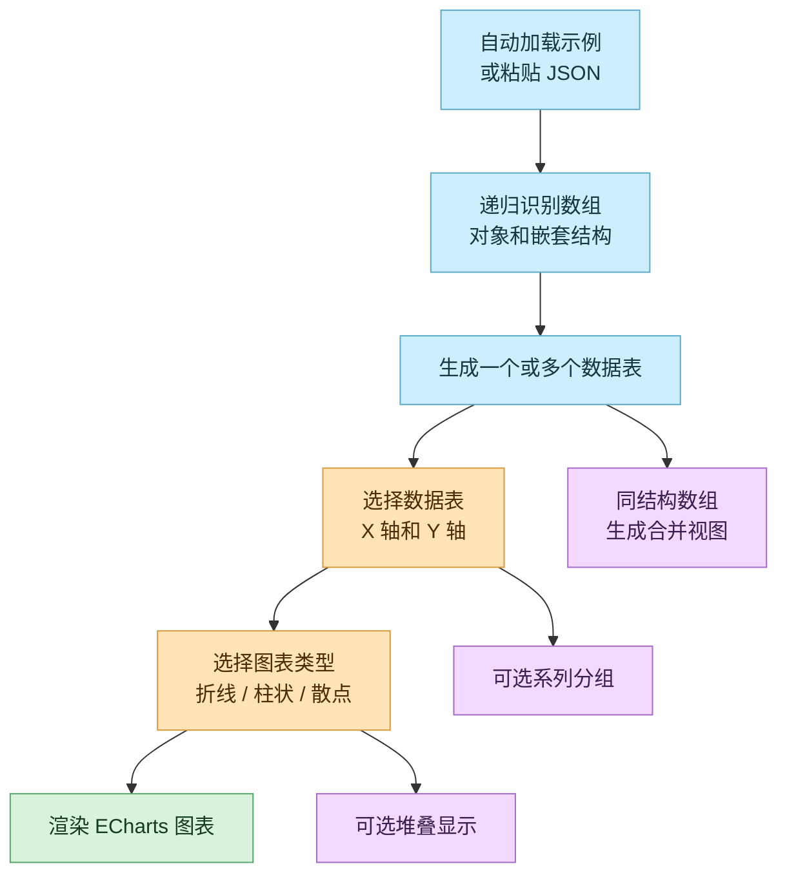

# ECharts Demo

一个基于 Next.js 和 ECharts 的 JSON 图表工作台。页面会自动加载示例数据，也支持粘贴一般性的 JSON 数组或对象，自动识别其中可绘制的数据表，再由用户选择 X 轴、Y 轴、分组字段和图表类型。

在线访问：https://etng.github.io/echarts-demo/

## 功能概览



当前页面提供以下能力：

- 默认加载 `public/aio.json` 示例数据，打开页面即可看到图表。
- 支持粘贴 JSON 数组、JSON 对象，以及对象中嵌套的数组。
- 自动把数组识别为数据表；同结构的多个数组会额外生成合并视图。
- 对象路径上的层级会生成独立下拉筛选，例如地区、时间区间。
- 自动识别字段类型：时间、数值、布尔、文本。
- 支持选择 X 轴字段、一个或多个 Y 轴数值字段。
- 支持按文本字段分组生成多条系列。
- 支持折线图、柱状图、散点图。
- 支持折线图和柱状图堆叠显示。
- Tooltip、坐标轴和缩放控件由 ECharts 处理。

## 技术栈

- Next.js App Router
- React 18
- TypeScript
- Tailwind CSS
- ECharts / echarts-for-react

## 快速开始

建议使用 Node.js 18 或更高版本。项目当前声明 `yarn@4.3.0`，建议优先使用 Yarn。

```bash
yarn
yarn dev
```

启动后打开：

```text
http://localhost:3000
```

如果本机端口已被占用，Next.js 会自动切换到下一个可用端口。

如果需要使用 npm，也可以执行：

```bash
npm install
npm run dev
```

请尽量避免在同一次依赖更新里混用 npm 和 Yarn，避免锁文件出现不一致。

## 常用命令

```bash
yarn dev      # 启动本地开发服务
yarn build    # 构建生产版本
yarn start    # 启动生产服务
yarn lint     # 运行 ESLint
```

## 支持的数据形态

数组对象：

```json
[
  {
    "date": "2026-06-01",
    "sales": 120,
    "region": "华东"
  },
  {
    "date": "2026-06-02",
    "sales": 180,
    "region": "华东"
  }
]
```

对象中的嵌套数组：

```json
{
  "east": {
    "daily": [
      {
        "date": "2026-06-01",
        "sales": 120
      }
    ]
  },
  "west": {
    "daily": [
      {
        "date": "2026-06-01",
        "sales": 90
      }
    ]
  }
}
```

识别规则：

- 数组会被识别为数据表。
- 数组里的对象会被展平，嵌套对象字段会变成 `parent.child`。
- 数组里的普通值会被包装成 `value` 字段。
- 对象中多个结构相同的数组会生成“合并 N 个同结构数组”的数据表。
- 页面会额外生成 `数据来源`、`路径 1`、`路径 2` 等辅助字段。
- `路径 1`、`路径 2` 等路径字段会自动显示为下拉筛选，用于筛选到具体数组。
- 某个路径筛选选择“全部”时，该路径会自动作为系列分组，避免不同路径的数据混到同一条曲线里。
- 示例数据中，`路径 1` 对应 5 个地区，`路径 2` 对应 `Daily31`、`Hourly72` 两个时间区间。

## 示例数据

`public/aio.json` 是当前页面默认加载的示例数据。它本身是多地区、多时间区间结构，但页面会把其中的数组识别成通用数据表，而不是写死为网络流量格式。

`public/data.json` 是单个时间序列数组样例，也可以直接粘贴到页面中使用。

## 项目结构

```text
.
├── public/
│   ├── aio.json       # 嵌套对象示例数据
│   └── data.json      # 单数组示例数据
├── src/app/
│   ├── page.tsx       # JSON 解析、字段选择与 ECharts 配置
│   ├── layout.tsx     # 根布局与页面元信息
│   └── globals.css    # 全局样式与 Tailwind 引入
├── package.json       # 依赖与脚本
└── next.config.js     # Next.js 配置
```

## 维护提示

- 图表和数据识别逻辑集中在 `src/app/page.tsx`。
- 如果要支持更多图表类型，重点扩展 `chartTypes` 和 ECharts `series` 生成逻辑。
- 如果不需要默认示例数据，可移除 `src/app/page.tsx` 中对 `/aio.json` 的初始化加载。

## 已知问题

- 当前优先面向桌面端工作台布局，暂不保证移动端体验。
- 通用识别以“表格型 JSON”为目标，复杂树结构仍会优先抽取其中的数组。
- 路径筛选选择“全部”时会自动拆分系列，系列较多时图例可读性还有优化空间。
- 字段类型识别是启发式规则，少数日期或数值字符串可能需要后续继续调整。
